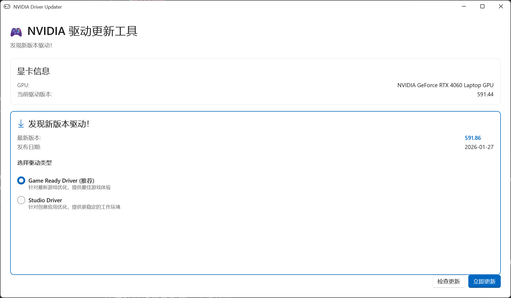

# NvwUpd - NVIDIA 驱动更新工具

[](../LICENSE)
[](https://dotnet.microsoft.com/)
[](https://www.microsoft.com/windows)

中文/**[English](../README.md)**

一个轻量级的 Windows 应用程序，用于检查和更新 NVIDIA GPU 驱动，无需安装 GeForce Experience。



## 功能特性

- 🔍 **自动检测 GPU** - 通过 WMI 自动检测您的 NVIDIA 显卡
- 📡 **官方 NVIDIA API** - 使用与 nvidia.com/Download 相同的官方 API
- 🎮 **驱动类型选择** - 可选择 Game Ready 驱动或 Studio 驱动
- 🔔 **Windows 通知** - 有更新时发送系统通知
- ⏰ **定期检查更新** - 后台自动检查更新
- 🎨 **现代化界面** - 基于 WinUI 3 和 Fluent Design 构建
- 📦 **独立运行** - 无需 GeForce Experience

## 系统要求

- Windows 10 版本 1809 或更高 / Windows 11
- NVIDIA GeForce 显卡（推荐 GTX 10 系列或更新）
- .NET 8.0 运行时

## 安装

### 从 Release 安装

1. 从 [Releases](https://github.com/yourusername/nvwupd/releases) 下载最新版本
2. 解压压缩包
3. 运行 `NvwUpd.exe`

### 从源码构建

```powershell
# 克隆仓库
git clone https://github.com/yourusername/nvwupd.git
cd nvwupd

# 构建项目
dotnet build -c Release -p:Platform=x64

# 运行应用
.\bin\x64\Release\net8.0-windows10.0.22621.0\NvwUpd.exe
```

## 使用方法

1. 启动 NvwUpd
2. 应用会自动检测您的 GPU 和当前驱动版本
3. 点击"检查更新"查看是否有最新驱动
4. 选择您偏好的驱动类型（Game Ready 或 Studio）
5. 点击"下载并安装"来更新驱动

## 工作原理

NvwUpd 使用 NVIDIA 官方下载 API 获取驱动信息：

1. **GPU 检测** - 使用 WMI 检测已安装的 NVIDIA GPU
2. **产品查询** - 查询 NVIDIA API 获取产品系列 ID (psid) 和产品 ID (pfid)
3. **驱动获取** - 从 `processFind.aspx` 端点请求驱动列表
4. **下载** - 从 NVIDIA CDN 下载驱动
5. **安装** - 使用 `-s -noreboot` 参数进行静默安装

技术细节请参阅 [驱动获取 API 文档](fetch-zh_CN.md)。

## 项目结构

```
NvwUpd/
├── Core/                   # 核心业务逻辑
│   ├── GpuDetector.cs     # GPU 检测（WMI）
│   ├── DriverFetcher.cs   # NVIDIA API 集成
│   ├── DriverDownloader.cs # 带进度的下载
│   └── DriverInstaller.cs # 静默安装
├── Services/              # 后台服务
│   ├── NotificationService.cs
│   └── UpdateChecker.cs
├── ViewModels/            # MVVM 视图模型
└── Models/                # 数据模型
```

## 配置

设置存储在 `%APPDATA%\NvwUpd\settings.json`：

```json
{
  "preferredDriverType": "GameReady",
  "checkIntervalHours": 24,
  "autoDownload": false,
  "showNotifications": true
}
```

| 配置项 | 说明 | 默认值 |
|--------|------|--------|
| `preferredDriverType` | 首选驱动类型：`GameReady` 或 `Studio` | `GameReady` |
| `checkIntervalHours` | 检查更新间隔（小时） | `24` |
| `autoDownload` | 发现更新时自动下载 | `false` |
| `showNotifications` | 显示系统通知 | `true` |

## 贡献

欢迎贡献代码！请随时提交 Pull Request。

1. Fork 本仓库
2. 创建您的功能分支 (`git checkout -b feature/AmazingFeature`)
3. 提交您的更改 (`git commit -m 'Add some AmazingFeature'`)
4. 推送到分支 (`git push origin feature/AmazingFeature`)
5. 发起 Pull Request

## 许可证

本项目采用 MIT 许可证 - 详见 [LICENSE](../LICENSE) 文件。

## 免责声明

本项目与 NVIDIA Corporation 没有任何关联、认可或赞助关系。NVIDIA、GeForce 及相关标志是 NVIDIA Corporation 的商标。

## 致谢

- [Windows App SDK](https://github.com/microsoft/WindowsAppSDK)
- [CommunityToolkit.Mvvm](https://github.com/CommunityToolkit/dotnet)
- [H.NotifyIcon](https://github.com/HavenDV/H.NotifyIcon)
