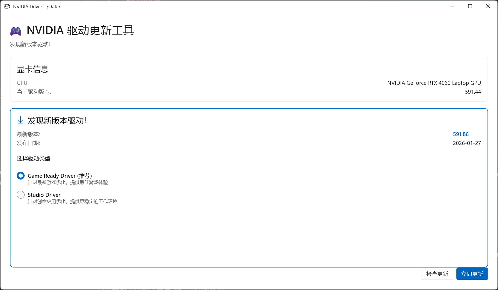

# NvwUpd - NVIDIA 驱动更新工具

[](../LICENSE)
[](https://dotnet.microsoft.com/)
[](https://www.microsoft.com/windows)

中文 / **[English](../README.md)**

一个轻量级的 Windows 应用程序，用于检查和更新 NVIDIA GPU 驱动，无需安装 NVIDIA App。



## 功能特性

- **自动检测 GPU** - 通过 WMI 自动检测您的 NVIDIA 显卡
- **官方 NVIDIA API** - 使用与 nvidia.com/Download 相同的官方 API
- **驱动类型选择** - 可选择 Game Ready 驱动或 Studio 驱动
- **Windows 通知** - 有更新时发送系统通知
- **定期检查更新** - 后台自动检查更新
- **现代化界面** - 基于 WinUI 3 和 Fluent Design 构建

## 系统要求

- Windows 10 版本 1809 或更高 / Windows 11
- NVIDIA GeForce 显卡
- .NET 8.0 运行时

## 安装

### 从 Release 安装

1. 从 [Releases](https://github.com/zlicdt/nvwupd/releases) 下载最新版本
2. 解压压缩包
3. 运行 `NvwUpd.exe`

### 从源码构建

```powershell
# 克隆仓库
git clone https://github.com/zlicdt/nvwupd.git
cd nvwupd

# 构建项目
dotnet build NvwUpd.csproj -c Release -p:Platform=x64

# 运行应用
.\bin\x64\Release\net8.0-windows10.0.22621.0\NvwUpd.exe
```

## 使用方法

1. 启动 NvwUpd
2. 应用会自动检测您的 GPU 和当前驱动版本
3. 点击"检查更新"查看是否有最新驱动
4. 选择您偏好的驱动类型（Game Ready 或 Studio）
5. 点击"下载并安装"来更新驱动

## 工作原理

NvwUpd 使用 NVIDIA 官方下载 API 获取驱动信息：

1. **GPU 检测** - 使用 WMI 检测已安装的 NVIDIA GPU
2. **产品查询** - 查询 NVIDIA API 获取产品系列 ID (psid) 和产品 ID (pfid)
3. **驱动获取** - 从 `processFind.aspx` 端点请求驱动列表
4. **下载** - 从 NVIDIA CDN 下载驱动
5. **安装** - 使用 `-s -noreboot` 参数进行静默安装

技术细节请参阅 [驱动获取 API 文档](fetch-zh_CN.md)。

## 项目结构

```
NvwUpd/
├── Assets/                         # 应用程序资源
│   ├── nvidia.ico                  # 应用程序图标
│   └── nvidia.png                  # 应用程序图片
├── Core/                           # 核心业务逻辑
│   ├── Interfaces.cs               # 核心接口定义
│   ├── GpuDetector.cs              # GPU 检测（WMI）
│   ├── DriverFetcher.cs            # NVIDIA API 集成
│   ├── DriverDownloader.cs         # 带进度的下载
│   └── DriverInstaller.cs          # 静默安装
├── Models/                         # 数据模型与配置
│   ├── AppSettings.cs              # 应用程序设置
│   └── DriverModels.cs             # 驱动数据模型
├── Services/                       # 应用程序服务
│   ├── IServices.cs                # 服务接口定义
│   ├── LocalizationService.cs      # 本地化支持
│   ├── NotificationService.cs      # Windows 通知
│   ├── SettingsService.cs          # 设置管理
│   ├── StartupService.cs           # Windows 开机启动管理
│   ├── TrayIconManager.cs          # 系统托盘图标
│   └── UpdateChecker.cs            # 定期更新检查
├── Strings/                        # 本地化资源
│   ├── de/Resources.resw           # 德语
│   ├── en/Resources.resw           # 英语
│   ├── ja/Resources.resw           # 日语
│   ├── zh-CN/Resources.resw        # 简体中文
│   └── zh-TW/Resources.resw        # 繁体中文
├── ViewModels/                     # MVVM 视图模型
│   ├── ViewModelBase.cs            # ViewModel 基类
│   ├── MainViewModel.cs            # 主窗口 ViewModel
│   └── UpdateDialogViewModel.cs    # 更新对话框 ViewModel
├── App.xaml / App.xaml.cs          # 应用入口，DI 配置
├── MainWindow.xaml / .cs           # 主 UI 窗口
└── scripts/                        # 辅助脚本
    ├── nvwupd-installer.iss        # InnoSetup 安装程序脚本
    └── set-version.ps1             # 版本管理脚本
```

## 贡献

欢迎贡献代码！请随时提交 Pull Request。

1. Fork 本仓库
2. 创建您的功能分支 (`git checkout -b feature/AmazingFeature`)
3. 提交您的更改 (`git commit -m 'Add some AmazingFeature'`)
4. 推送到分支 (`git push origin feature/AmazingFeature`)
5. 发起 Pull Request

## 许可证

本项目采用 MIT 许可证 - 详见 [LICENSE](../LICENSE) 文件。

## 免责声明

本项目与 NVIDIA Corporation 没有任何关联、认可或赞助关系。NVIDIA、GeForce 及相关标志是 NVIDIA Corporation 的商标。

## 致谢

- [Windows App SDK](https://github.com/microsoft/WindowsAppSDK)
- [CommunityToolkit.Mvvm](https://github.com/CommunityToolkit/dotnet)
