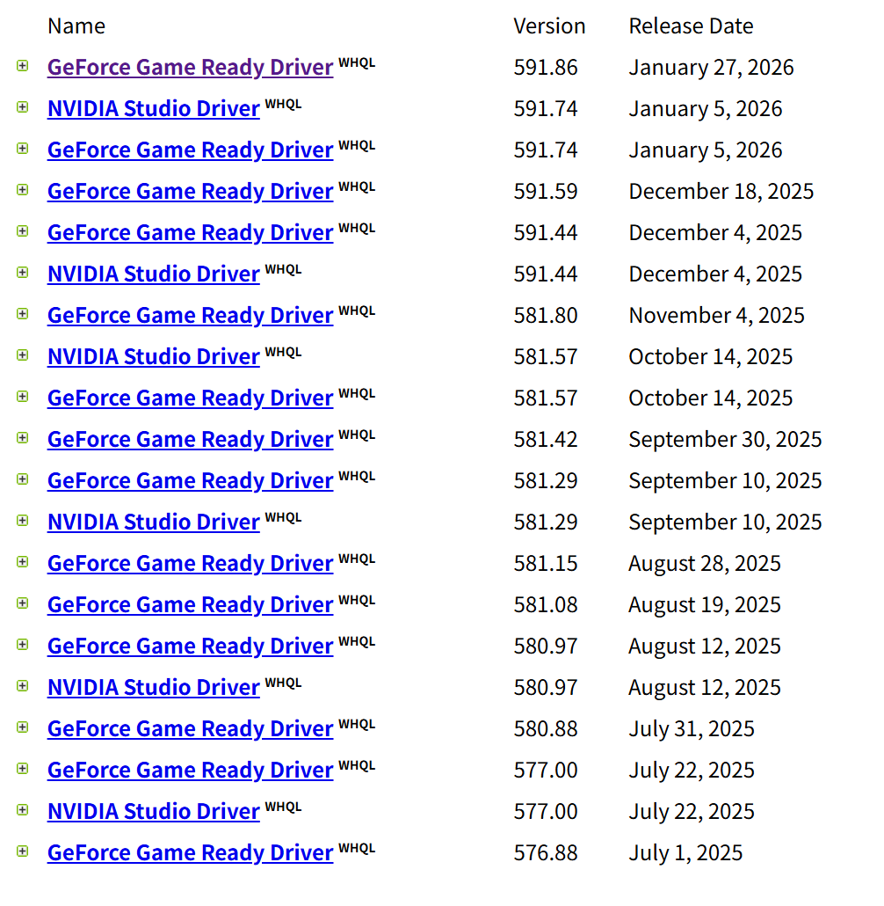

# 驱动获取 API 说明

**[English](fetch.md)**

本文档介绍 NVIDIA 官方 API 的使用方法，通过这些 API 可以获取特定 GPU 型号的驱动列表。

## API 概述

NVIDIA 提供了一套公开的 API 用于驱动下载页面，我们可以直接调用这些 API 来获取驱动信息。

### API 端点

| 端点 | 用途 |
|------|------|
| `lookupValueSearch.aspx?TypeID=2` | 获取产品系列列表（psid） |
| `lookupValueSearch.aspx?TypeID=3` | 获取具体产品列表（pfid） |
| `lookupValueSearch.aspx?TypeID=4` | 获取操作系统列表（osid） |
| `processFind.aspx` | 根据参数查询驱动列表 |

## 获取参数值

首先使用 PowerShell 命令测试 API 返回的格式。

### 获取 Windows 11 的 osid

```pwsh
[Net.ServicePointManager]::SecurityProtocol=[Net.SecurityProtocolType]::Tls12
(Invoke-RestMethod -Uri "https://www.nvidia.com/Download/API/lookupValueSearch.aspx?TypeID=4" -Headers @{"User-Agent"="Mozilla/5.0"}).LookupValueSearch.LookupValues.LookupValue | ? { $_.Name -eq "Windows 11" -or $_.Name -match '^Windows\s*11(\s*64-?bit)?$' }
```

返回结果：
```text
Code Name       Value
---- ----       -----
10.0 Windows 11 135
```

可见 `osid` 为 **135**。

### 获取 RTX 40 系列笔记本的 psid

```pwsh
[Net.ServicePointManager]::SecurityProtocol=[Net.SecurityProtocolType]::Tls12
(Invoke-RestMethod -Uri "https://www.nvidia.com/Download/API/lookupValueSearch.aspx?TypeID=2" -Headers @{"User-Agent"="Mozilla/5.0"}).LookupValueSearch.LookupValues.LookupValue | ? { $_.Name -match 'GeForce' -and $_.Name -match 'RTX\s*40' -and $_.Name -match 'Notebook' } | select -First 1 -ExpandProperty Value
```

返回结果：
```text
129
```

因此 `psid` 为 **129**。

### 获取 GeForce RTX 4060 Laptop GPU 的 pfid

> 注意：笔记本 GPU 的名称字符串通常没有 NVIDIA 前缀，但台式机版本有

```pwsh
[Net.ServicePointManager]::SecurityProtocol=[Net.SecurityProtocolType]::Tls12
(Invoke-RestMethod -Uri "https://www.nvidia.com/Download/API/lookupValueSearch.aspx?TypeID=3" -Headers @{"User-Agent"="Mozilla/5.0"}).LookupValueSearch.LookupValues.LookupValue | ? { $_.Name -eq "GeForce RTX 4060 Laptop GPU" } | select -First 1 -ExpandProperty Value
```

返回结果：
```text
1007
```

因此 `pfid` 为 **1007**。

## 查询驱动列表

使用获取到的参数构造 URL：

```
https://www.nvidia.com/Download/processFind.aspx?dtcid=1&lang=zh-hans&lid=1&osid=135&pfid=1007&psid=129
```

### 参数说明

| 参数 | 说明 | 示例值 |
|------|------|--------|
| `dtcid` | 驱动类型：1=Game Ready，0=Studio | `1` |
| `lang` | 语言代码 | `en-us`, `zh-hans` |
| `lid` | 语言 ID | `1` |
| `osid` | 操作系统 ID | `135` (Windows 11) |
| `pfid` | 产品 ID | `1007` (RTX 4060 Laptop) |
| `psid` | 产品系列 ID | `129` (RTX 40 Notebooks) |

### 响应格式

API 返回一个 HTML 表格，包含可用的驱动列表：



点击第一个链接，进入 `https://www.nvidia.com/en-us/drivers/details/xxxx/` 页面，可以通过点击"Download"按钮下载驱动。

## 下载 URL 格式

驱动下载 URL 遵循以下格式：

**笔记本版本：**
```
https://us.download.nvidia.com/Windows/{版本号}/{版本号}-notebook-win10-win11-64bit-international-dch-whql.exe
```

**台式机版本：**
```
https://us.download.nvidia.com/Windows/{版本号}/{版本号}-desktop-win10-win11-64bit-international-dch-whql.exe
```

### 示例

```
https://us.download.nvidia.com/Windows/591.86/591.86-notebook-win10-win11-64bit-international-dch-whql.exe
```

## 代码实现

在 NvwUpd 中，`DriverFetcher.cs` 实现了以上 API 调用：

1. 首先从 `TypeID=2` 和 `TypeID=3` 获取 psid 和 pfid
2. 从 `TypeID=4` 获取当前 Windows 版本的 osid
3. 调用 `processFind.aspx` 获取驱动列表
4. 解析 HTML 响应提取版本号和驱动 ID
5. 构造下载 URL

这种方式的优点是无需硬编码产品 ID，当 NVIDIA 发布新显卡时代码无需修改。
